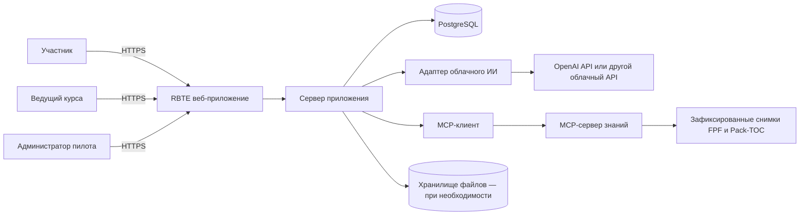
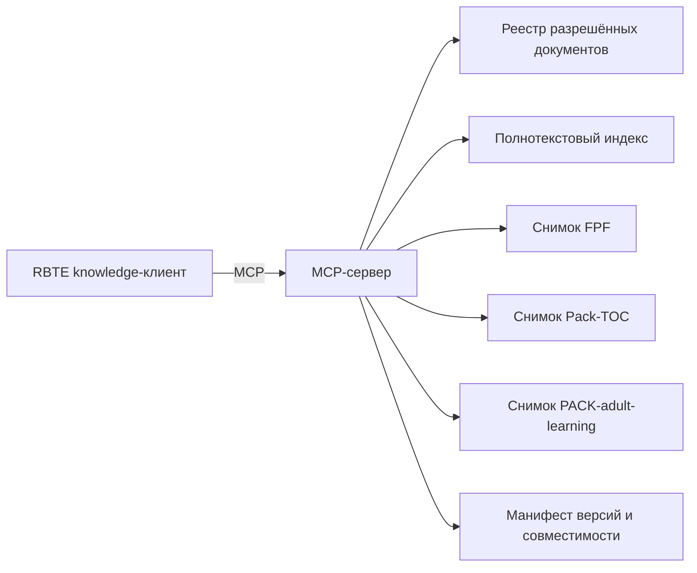
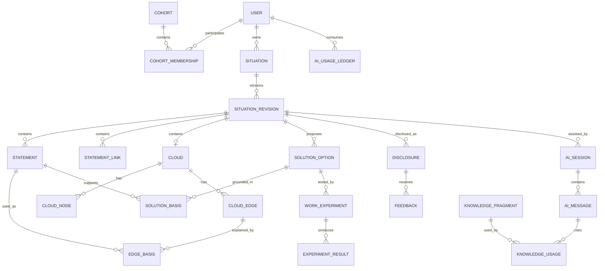
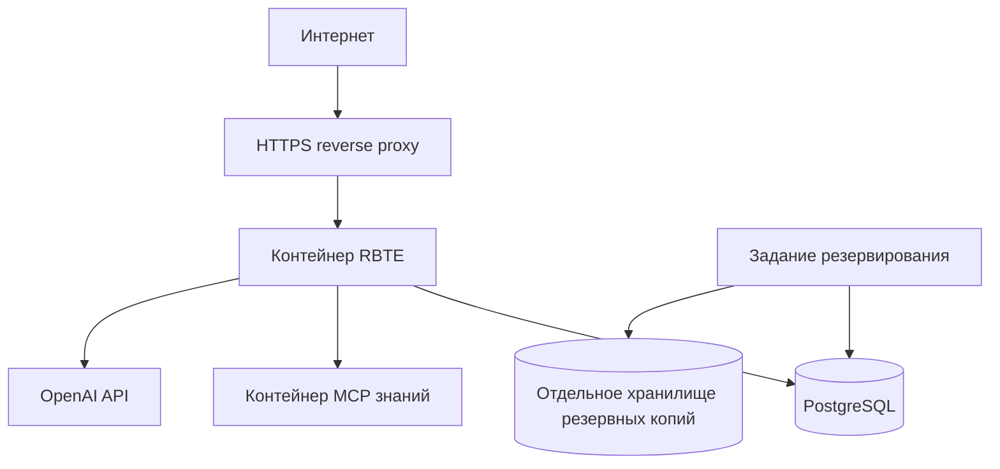

# Архитектура и модель данных первого варианта RBTE

**Рабочий продукт:** WP-45
**Статус:** проект архитектуры для согласования пилотом
**Основание:** `ТЗ на первый вариант RBTE.md`

## 1. Архитектурная цель

Создать минимальную техническую систему, которая поддерживает полный цикл четырёх пилотных ситуаций: исследование → решение → рабочая проба → фактический результат → следующая итерация. Главные качества первого варианта — сохранность рассуждения, управляемое раскрытие, ответственность человека и проверяемое использование FPF, Pack-TOC и PACK-adult-learning.

Архитектура является пилотной. Она должна позволять быстро изменять маршрут, но не должна создавать технический долг, из-за которого придётся терять историю ситуаций или менять модель доступа после пилота.

## 2. Принятые архитектурные решения

| Решение | Выбор | Почему |
|---|---|---|
| Форма системы | модульное веб-приложение | один развёртываемый контур проще проверить и изменить, чем микросервисы |
| Основной язык | TypeScript | один язык для интерфейса, серверной логики, схем и MCP-сервера |
| Веб-контур | Next.js с серверными обработчиками | позволяет собрать интерфейс и серверный API в одном проекте |
| База данных | PostgreSQL | транзакции, ограничения, JSONB, полнотекстовый поиск и зрелые средства резервирования |
| Доступ к данным | серверная авторизация плюс политики строк PostgreSQL | ошибка маршрута приложения не должна автоматически раскрывать чужую ситуацию |
| Работа с версиями | изменяемый черновик и неизменяемые зафиксированные редакции | сохраняет историю без полного событийного движка |
| ИИ | внешний облачный API через заменяемый адаптер | локальная модель исключена из пилота; поставщик не должен определять модель данных |
| Знания | отдельный MCP-сервер чтения | ИИ получает только разрешённые, версионированные источники |
| Поиск знаний | детерминированный реестр и полнотекстовый поиск | для четырёх профилей векторная база пока не нужна |
| Файлы | объектное хранилище только при включении вложений или выгрузок | не усложнять первый вертикальный срез |
| Развёртывание | контейнеры приложения и MCP плюс PostgreSQL | воспроизводимый запуск на одном управляемом сервере |

Конкретные версии библиотек фиксируются в файле зависимостей при начале реализации. Архитектурные границы не должны зависеть от версии отдельной библиотеки.

## 3. Контекст системы



Браузер никогда не обращается напрямую к базе данных, OpenAI API или MCP-серверу. Все полномочия, лимиты и состав передаваемого контекста проверяет сервер приложения.

## 4. Состав приложения

Приложение остаётся одним развёртываемым сервисом, но код разделяется на модули с явными границами.

| Модуль | Ответственность | Не отвечает за |
|---|---|---|
| `identity` | приглашения, вход, сессии, роли, согласия | содержимое ситуаций |
| `situations` | жизненный цикл ситуации, профиль, участники, статусы | методические подсказки |
| `revisions` | черновики, фиксация и создание следующей редакции | выбор правильности содержания |
| `reasoning` | утверждения, их типы, носители, источники и связи; рабочий запрос, опыт и требуемое действие участника | генерацию ответа ИИ и психологическую диагностику личности |
| `clouds` | узлы A/B/C/D/D’, стрелки и основания связей | автоматическое признание тучи правильной |
| `solutions` | варианты, выбор человека, риски и изменения контекста | выбор решения за человека |
| `experiments` | рабочая проба, условия переноса, поддержка, выполнение, наблюдение и следующая итерация | оперативное управление работой |
| `disclosures` | снимок предъявления, получатели и отзыв | доступ к закрытому черновику |
| `ai` | сбор разрешённого контекста, вызов модели, разбор ответа и лимиты | хранение основной истины ситуации |
| `knowledge` | обращения к MCP и трассировка источников | изменение FPF или Pack |
| `audit` | события безопасности и административные действия | содержательная оценка участника |
| `pilot` | раздельные обезличенные показатели прохождения, удовлетворённости, освоения, переноса и рабочего эффекта | рейтинг людей или вывод об эффекте из одного доступного показателя |

Зависимости модулей направлены через прикладные сервисы. Обработчик веб-запроса не должен напрямую изменять таблицы другого модуля.

## 5. Архитектура ИИ

### 5.1. Последовательность обращения

1. Пользователь выбирает шаг и задаёт вопрос или просит помощь.
2. Сервер проверяет доступ к ситуации и лимит пользователя.
3. Сервер выбирает только необходимые элементы текущей редакции.
4. Модуль знаний запрашивает через MCP разрешённые материалы для профиля и шага.
5. Сервер формирует инструкцию, пользовательский контекст и ссылки на знания как разные части запроса.
6. Облачная модель возвращает структурированный ответ.
7. Сервер проверяет схему ответа и сохраняет запрос, расход, ссылки и предложение ИИ.
8. Пользователь принимает, редактирует или отклоняет предложение.
9. Только явное действие пользователя меняет содержимое ситуации.

### 5.2. Формат ответа ИИ

Адаптер приводит ответ любого поставщика к внутренней структуре:

```text
AIResponse
├── question                 один следующий вопрос
├── observations[]           найденные неоднозначности
├── candidateStatements[]    гипотезы, не подтверждённые утверждения
├── suggestedChanges[]       предлагаемые изменения элементов
├── checks[]                 способы проверки
├── supportOptions[]         доступная структура и человеческая поддержка
├── warnings[]               риск, отсутствие данных или конфликт источников
└── knowledgeRefs[]          использованные ссылки MCP
```

Свободный текст допустим только как пояснение. Изменения данных выполняются через проверенные структурированные команды приложения.

### 5.3. Защита контура

- ключ поставщика находится только в серверном хранилище секретов;
- в модель передаётся минимально необходимый контекст;
- перед отправкой может применяться маскирование имён и компаний;
- инструкции из пользовательского текста и Pack считаются данными, а не системными командами;
- ответ модели не исполняет SQL, код или вызов MCP;
- таймаут или ошибка поставщика не отменяет сохранённое действие пользователя;
- каждый запрос получает идентификатор идемпотентности, чтобы повтор не удваивал списание и записи;
- общий и индивидуальный бюджеты проверяются до вызова и учитываются после него.

## 6. MCP-сервер знаний

### 6.1. Состав

MCP-сервер является отдельным процессом только потому, что это самостоятельная граница полномочий и обновления знаний. В пилоте он работает в режиме чтения и может быть развёрнут рядом с приложением.



### 6.2. Операции

| Операция | Результат |
|---|---|
| `knowledge.search` | список релевантных фрагментов для профиля, шага и вопроса |
| `knowledge.get` | нормативный фрагмент по устойчивому идентификатору |
| `knowledge.get_work_product_schema` | схема тучи или другого рабочего продукта |
| `knowledge.get_failure_modes` | типовые ошибки текущего шага |
| `knowledge.get_distinctions` | необходимые различения FPF, Pack-TOC или PACK-adult-learning |
| `knowledge.get_manifest` | версии, коммиты, разрешённые пути и статус совместимости |

Сервер возвращает текст, устойчивый идентификатор, путь, заголовок раздела, версию источника, статус зрелости Pack, статус знания (`current`, `hypothesis` или `deprecated-interpretation`) и контрольную сумму фрагмента. Он не принимает изменения в FPF или Pack.

### 6.3. Подготовка снимка знаний

1. Пилот утверждает коммиты FPF, Pack-TOC и PACK-adult-learning и разрешённые пути каждого источника.
2. Сборщик проверяет разрешённые пути и терминологическую совместимость.
3. Из документов выделяются адресуемые разделы с происхождением.
4. Строится индекс и манифест.
5. Снимок получает собственный идентификатор и контрольную сумму.
6. Приложение фиксирует идентификатор снимка в каждой сессии ИИ.

Обновление создаёт новый снимок. Старый остаётся доступным для воспроизведения истории, но не выбирается для новых сессий после отзыва.

Для PACK-adult-learning первый снимок фиксируется на коммите `4bd0706`. Его версия `0.1.0`, общий статус зрелости `draft` и статус знания каждой сущности сохраняются в манифесте раздельно. Сущность со статусом знания `hypothesis` может быть выдана только как гипотеза и не проходит проверку обязательного правила автоматически.

### 6.4. Граница Pack-ATB

В схеме уже предусмотрено пространство имён источника. Позднее Pack-ATB подключается новым снимком и правилами маршрутизации. Сущности ситуации, тучи, решения и пробы при этом не изменяются. Подключение Pack-ATB требует отдельной содержательной приёмки и не выполняется скрытым расширением разрешённых путей.

## 7. Модель версий

### 7.1. Правило

У ситуации есть одна изменяемая редакция со статусом `draft`. Зафиксированная редакция `frozen` неизменяема. Фиксация обязательна при:

- предъявлении ведущему курса;
- утверждении плана рабочей пробы;
- фиксации фактического результата;
- возврате к зависимому основанию с созданием следующей итерации;
- закрытии ситуации.

После фиксации сервер транзакционно создаёт новый черновик как потомка зафиксированной редакции. Удаление старых содержательных строк запрещено; они принадлежат истории соответствующей редакции.

### 7.2. Почему не полный журнал событий

Полный событийный подход потребует проектировать восстановление состояния из десятков типов событий до проверки пользовательского маршрута. Для пилота достаточно неизменяемых редакций, отдельного журнала аудита и явных ссылок происхождения. Переход к событиям возможен позднее без изменения внешнего поведения.

## 8. Логическая модель данных



## 9. Таблицы и ключевые поля

Во всех таблицах используются UUID, время UTC и технические поля создания. Содержательные поля с личными данными не попадают в технические журналы.

### 9.1. Пользователи и пилот

#### `users`

| Поле | Тип | Ограничение |
|---|---|---|
| `id` | UUID | первичный ключ |
| `email` | text | уникально, нормализовано |
| `display_name` | text | может быть псевдонимом |
| `status` | enum | `invited`, `active`, `blocked`, `deleted` |
| `created_at` | timestamptz | обязательно |

#### `cohorts`

`id`, `name`, `starts_at`, `ends_at`, `status`.

#### `cohort_memberships`

`cohort_id`, `user_id`, `role` (`participant`, `facilitator`, `pilot_admin`), `joined_at`. Уникальность пары `cohort_id + user_id`.

#### `consents`

`id`, `user_id`, `kind`, `policy_version`, `granted_at`, `withdrawn_at`. Отзыв не стирает факт ранее действовавшего согласия.

#### `invitations`

`id`, `cohort_id`, `email`, `role`, `token_hash`, `expires_at`, `accepted_at`. Хранится хеш токена, а не сам токен.

### 9.2. Ситуация и редакции

#### `situations`

| Поле | Тип | Назначение |
|---|---|---|
| `id` | UUID | стабильный идентификатор ситуации |
| `owner_id` | UUID | владелец |
| `cohort_id` | UUID | пилотный контур |
| `profile` | enum | `personal_dilemma`, `party_conflict`, `firefighting_cloud`, `individual_immunity` |
| `title` | text | виден только владельцу до предъявления |
| `sensitivity` | enum | `personal`, `company_confidential`, `restricted` |
| `status` | enum | `active`, `closed`, `deleted` |
| `current_revision_id` | UUID | текущий черновик |
| `deleted_at` | timestamptz | мягкое удаление |

#### `situation_revisions`

| Поле | Тип | Назначение |
|---|---|---|
| `id` | UUID | идентификатор редакции |
| `situation_id` | UUID | родительская ситуация |
| `number` | integer | уникален внутри ситуации |
| `parent_revision_id` | UUID nullable | происхождение следующей итерации |
| `status` | enum | `draft`, `frozen` |
| `reason` | enum | `initial`, `checkpoint`, `disclosure`, `experiment_plan`, `experiment_result`, `iteration`, `closure` |
| `profile_payload` | JSONB | поля конкретного профиля и учебного контекста по проверяемой схеме: рабочая задача, требуемое действие, относящийся опыт, готовность к самостоятельности и выбранная поддержка |
| `knowledge_snapshot_id` | UUID | версия знаний для сопровождения |
| `created_by` | UUID | автор редакции |
| `created_at`, `frozen_at` | timestamptz | временная ось |

Ограничения: одна редакция `draft` на ситуацию; `frozen` нельзя изменять триггером базы; номер возрастает; родитель принадлежит той же ситуации.

### 9.3. Утверждения и связи

#### `statements`

| Поле | Тип | Назначение |
|---|---|---|
| `id` | UUID | идентификатор внутри редакции |
| `revision_id` | UUID | редакция |
| `type` | enum | см. перечень ниже |
| `text` | text | формулировка |
| `holder_type` | enum | `person`, `company`, `artifact`, `none` |
| `holder_ref` | text nullable | лицо, компания или артефакт в границе ситуации |
| `epistemic_status` | enum | `candidate`, `user_confirmed`, `supported`, `weakened`, `rejected`, `unknown` |
| `source_type` | enum | `user`, `other_party_reported`, `document`, `ai_candidate`, `observation`, `knowledge_source` |
| `source_note` | text nullable | понятное происхождение |
| `context` | JSONB | условия применимости |
| `created_by` | UUID | человек или системный субъект |

Допустимые типы утверждений:

- `observation` — наблюдение;
- `explanation` — объяснение;
- `unknown` — неизвестное;
- `person_belief` — убеждение конкретного человека;
- `company_assumption` — предположение компании;
- `artifact_assumption` — допущение метода, стратегии или иного артефакта;
- `need` — существенная потребность;
- `decision` — принятое решение;
- `plan` — намерение или план;
- `action` — фактически выполненное действие;
- `result` — наблюдаемый результат;
- `interpretation` — интерпретация результата.

Проверка базы запрещает сочетания `person_belief + holder_type != person`, `company_assumption + holder_type != company` и `artifact_assumption + holder_type != artifact`.

#### `statement_links`

`id`, `revision_id`, `from_statement_id`, `to_statement_id`, `relation_type`, `status`, `created_by`. Типы связи: `supports`, `contradicts`, `explains`, `depends_on`, `tests`, `derived_from`, `replaces`.

### 9.4. Туча

#### `clouds`

`id`, `revision_id`, `kind`, `title`, `user_confirmed_at`.

#### `cloud_nodes`

`id`, `cloud_id`, `role` (`A`, `B`, `C`, `D`, `D_PRIME`), `text`, `statement_id`, `position_x`, `position_y`. В одной туче допустим один узел каждой обязательной роли.

#### `cloud_edges`

`id`, `cloud_id`, `from_node_id`, `to_node_id`, `edge_type` (`necessity`, `conflict`), `user_confirmed_at`.

#### `edge_bases`

`edge_id`, `statement_id`, `position`, `is_limiting_candidate`. Основание обязано быть утверждением правильного типа и принадлежать той же редакции.

### 9.5. Решения и рабочие пробы

#### `solution_options`

`id`, `revision_id`, `title`, `description`, `mechanism`, `context_changes` JSONB, `risks` JSONB, `status` (`candidate`, `selected`, `rejected`), `selected_by`, `selected_at`. В редакции может быть выбран только один вариант.

#### `solution_bases`

`solution_id`, `statement_id`, `relation` (`overcomes`, `preserves`, `requires`, `risks`).

#### `work_experiments`

| Поле | Назначение |
|---|---|
| `id`, `solution_id` | идентичность и выбранное решение |
| `hypothesis` | что проверяется |
| `planned_action` | что предполагается сделать |
| `authority_boundary` | полномочия и необходимый мандат |
| `risk_level`, `safeguards` | допустимость и защита |
| `expected_observation` | ожидаемое наблюдение |
| `supporting_signal`, `weakening_signal` | различающая проверка |
| `feedback_due_at` | срок или ожидаемое событие |
| `status` | `draft`, `approved`, `running`, `blocked`, `completed`, `abandoned` |
| `approved_by`, `approved_at` | решение участника о допустимости |

#### `experiment_results`

`id`, `experiment_id`, `actual_action`, `observation`, `interpretation`, `occurred_at`, `recorded_at`, `evidence_refs` JSONB, `next_decision` (`continue`, `revise_solution`, `revisit_reasoning`, `close`), `next_revision_id`.

Ограничение: результат нельзя создать без отдельного `actual_action` и `observation`; план не копируется в эти поля автоматически.

### 9.6. Предъявление и отзыв

#### `disclosures`

| Поле | Назначение |
|---|---|
| `id` | идентификатор предъявления |
| `situation_id`, `revision_id` | источник; редакция обязана быть `frozen` |
| `owner_id`, `recipient_id` | кто раскрыл и кому |
| `snapshot` JSONB | точный неизменяемый состав раскрытого материала |
| `included_sections` JSONB | явный перечень разделов |
| `created_at`, `revoked_at` | период доступа |

Снимок нужен, чтобы последующее изменение ситуации не расширило раскрытие. Отзыв закрывает дальнейший доступ, но не удаляет факт предъявления и уже оставленный отзыв.

#### `feedback`

`id`, `disclosure_id`, `author_id`, `target_kind`, `target_ref`, `text`, `created_at`, `participant_decision` (`pending`, `accepted`, `rejected`), `decision_note`.

### 9.7. ИИ, знания и стоимость

#### `ai_sessions`

`id`, `revision_id`, `user_id`, `step`, `provider`, `model`, `system_prompt_version`, `knowledge_snapshot_id`, `started_at`, `ended_at`.

#### `ai_messages`

`id`, `session_id`, `role`, `content_encrypted`, `structured_payload` JSONB, `status`, `provider_request_id`, `idempotency_key`, `created_at`. Содержимое диалога не входит в предъявление автоматически.

#### `ai_suggestions`

`id`, `message_id`, `target_kind`, `target_ref`, `operation`, `payload` JSONB, `decision` (`pending`, `accepted`, `edited`, `rejected`), `decided_by`, `decided_at`. Применение выполняется только после решения пользователя.

#### `ai_usage_ledger`

`id`, `user_id`, `session_id`, `provider`, `model`, `input_units`, `output_units`, `cost_amount`, `currency`, `recorded_at`. Запись добавляется, а не перезаписывается.

#### `ai_budgets`

`id`, `scope_type` (`user`, `cohort`, `global`), `scope_id`, `period_start`, `period_end`, `hard_limit_amount`, `warning_limit_amount`, `currency`, `status`.

#### `knowledge_snapshots`

`id`, `name`, `fpf_commit`, `pack_toc_commit`, `pack_atb_commit` nullable, `manifest_hash`, `compatibility_status`, `created_at`, `activated_at`, `retired_at`.

#### `knowledge_fragments`

`id`, `snapshot_id`, `namespace`, `source_id`, `path`, `heading`, `content_hash`, `status`. Полный текст может храниться только в MCP-снимке; приложение хранит адрес и контрольную сумму.

#### `knowledge_usages`

`id`, `ai_message_id`, `fragment_id`, `mcp_query`, `use_kind`, `rank`, `created_at`.

### 9.8. Аудит

#### `audit_events`

`id`, `actor_id`, `action`, `object_type`, `object_id`, `outcome`, `request_id`, `ip_hash`, `metadata` JSONB, `created_at`.

В аудит попадают вход, отказ во входе, приглашение, изменение роли, фиксация редакции, предъявление, отзыв, административное действие, изменение бюджета и обращение к внешнему ИИ. Тексты личной ситуации, сообщения ИИ и содержание обратной связи в аудит не копируются.

## 10. Права доступа

### 10.1. Матрица

| Объект | Участник-владелец | Ведущий курса | Администратор |
|---|---:|---:|---:|
| Черновик ситуации | чтение и изменение | нет | нет |
| Зафиксированная, но не предъявленная редакция | чтение | нет | нет |
| Предъявленный снимок | чтение | чтение до отзыва | метаданные |
| Диалог с ИИ | чтение | нет | нет |
| Обратная связь | чтение и решение | создание и чтение своей | метаданные |
| Расход ИИ | собственный | нет | агрегаты и расход по пользователю |
| Аудит безопасности | собственные значимые события | собственные события | чтение технического аудита |

Администратор пилота не получает аварийного доступа к содержанию в первом варианте. Если такой доступ понадобится для поддержки, требуется отдельное решение, видимое согласие и полный аудит.

### 10.2. Реализация

Каждый прикладной запрос выполняет две проверки:

1. серверный сервис проверяет роль, владельца и область предъявления;
2. PostgreSQL применяет политику доступа к строкам по идентификатору пользователя и роли, установленным только сервером внутри транзакции.

Прямые идентификаторы объектов считаются недоверенными. Сервер не загружает объект до проверки области доступа. Фоновые задания используют отдельную ограниченную роль базы.

## 11. Транзакции и инварианты

Обязательные транзакции:

- фиксация редакции и создание нового черновика;
- выбор решения и снятие предыдущего выбора;
- утверждение пробы и фиксация редакции;
- запись результата и создание следующей редакции;
- создание предъявления и его неизменяемого снимка;
- резервирование бюджета, вызов ИИ и окончательная запись расхода с компенсацией при ошибке.

Ключевые инварианты:

- у ситуации один владелец и не более одного черновика;
- зафиксированная редакция неизменяема;
- элементы одной тучи принадлежат одной редакции;
- носитель основания соответствует терминологическому типу;
- гипотеза ИИ не получает статус `user_confirmed` без действия пользователя;
- предъявление указывает только на зафиксированную редакцию и содержит точный снимок;
- план пробы и результат хранятся раздельно;
- использование знания указывает на зафиксированный снимок FPF/Pack;
- расход ИИ нельзя записать дважды для одного запроса поставщика.

### 11.1. Минимальная модель угроз

| Угроза | Основная защита | Проверка перед пилотом |
|---|---|---|
| Подбор идентификатора чужой ситуации | проверка владельца на сервере и политика строк | отрицательные запросы всеми ролями |
| Случайное раскрытие черновика ведущему курса | отдельный неизменяемый снимок предъявления | сравнить доступные поля со списком раскрытия |
| Попадание ключа OpenAI в браузер или журнал | серверный секрет и фильтрация журналов | поиск секрета в сборке, ответах и логах |
| Включение лишнего контекста в запрос ИИ | серверный сборщик контекста по разрешённым полям | сохранить и проверить состав контрольного запроса без секрета |
| Инструкция внутри пользовательского текста или Pack | разделение системной инструкции и недоверенных данных | контрольные попытки изменить роль ИИ через содержимое ситуации |
| Подмена знания устаревшим фрагментом | снимок, контрольная сумма и статус совместимости | тест с отозванным снимком |
| Повторный запрос и двойное списание | идемпотентность и уникальность запроса поставщика | повтор одной команды при сетевом таймауте |
| Чтение личного содержания администратором | отдельная роль без прав на содержательные таблицы | прямые запросы от роли администратора |
| Восстановление удалённого материала из технического журнала | запрет содержательного текста в аудите | анализ примеров журналов и резервной копии |
| Вредоносное вложение | вложения исключены из первого среза либо изолированная проверка | подтвердить отсутствие загрузки до включения функции |

## 12. API приложения

Первый вариант использует внутренний HTTP API. Имена показывают границы, а не окончательный формат URL.

| Группа | Основные действия |
|---|---|
| Сессия | принять приглашение, войти, выйти, получить собственную роль |
| Ситуации | создать, получить список своих, изменить метаданные, закрыть, удалить |
| Редакции | получить черновик, сохранить, зафиксировать, создать следующую, сравнить |
| Утверждения | создать, изменить, связать, подтвердить, ослабить, отклонить |
| Туча | изменить узлы и стрелки, связать основания, подтвердить |
| Решения | создать варианты, связать основания, выбрать |
| Пробы | спроектировать, утвердить, отметить препятствие, записать результат |
| Предъявления | предварительно просмотреть, создать, отозвать, получить доступное |
| Отзывы | создать, принять, отклонить |
| ИИ | начать сессию, задать вопрос, принять или отклонить предложение, получить расход |
| Пилот | получить обезличенные агрегаты прохождения |

Все изменяющие запросы используют защиту от повторного выполнения. API никогда не принимает `owner_id`, роль или статус подтверждения ИИ как доверенное значение от браузера.

## 13. Развёртывание

### 13.1. Минимальная схема



PostgreSQL и MCP не публикуются в интернет. Административный интерфейс ограничивается отдельной ролью. Секреты задаются средствами окружения развёртывания и не хранятся в репозитории или базе.

### 13.2. Среды

- `development` — искусственные данные, отдельный ключ или отключённый ИИ;
- `staging` — контрольные ситуации без реальных персональных данных;
- `pilot` — реальные участники, отдельная база, ключ и бюджеты.

Копирование данных из `pilot` в `development` запрещено. Для воспроизведения дефекта создаётся обезличенный тестовый пример с согласия владельца материала.

### 13.3. Резервирование

- ежедневная резервная копия базы;
- хранение нескольких последовательных копий вне основного сервера;
- шифрование копий;
- тестовое восстановление отдельной базы до основной волны;
- фиксация времени последней успешной копии и результата восстановления;
- срок хранения и удаление определяются решением пилота до ввода реальных данных.

## 14. Сценарии отказа

| Отказ | Поведение |
|---|---|
| OpenAI API недоступен | данные сохраняются; ручной маршрут работает; запрос можно повторить идемпотентно |
| MCP недоступен | ИИ не утверждает, что выполнил доменную проверку; ручная работа продолжается |
| MCP вернул несовместимый источник | фрагмент блокируется, событие фиксируется, пользователю показывается отсутствие допустимого знания |
| Ответ ИИ не соответствует схеме | ответ не применяется к данным; сохраняется технический отказ без раскрытия текста в аудит |
| Исчерпан личный бюджет | новые вызовы ИИ блокируются; данные и ручная работа доступны |
| Исчерпан общий бюджет | вызовы блокируются для всех; администратор получает уведомление |
| Повтор отправки формы | идемпотентный ключ возвращает прежний результат без дублирования |
| Сбой при фиксации редакции | транзакция откатывается; черновик остаётся доступным |
| Отзыв предъявления | ведущий курса теряет дальнейший доступ; факт и ранее созданный отзыв сохраняются |
| Потеря основного сервера | система восстанавливается из проверенной резервной копии; потеря данных измеряется временем последней копии |

## 15. Проверка полным маршрутом личной дилеммы

| Шаг | Компоненты | Данные | Проверка |
|---|---|---|---|
| Создание | `identity`, `situations` | ситуация и первый черновик | доступ есть только у владельца |
| Рабочий запрос | `reasoning` | рабочая задача, требуемое действие, опыт и поддержка | тема курса или функция системы не принимается за запрос; готовность не выводится из возраста или должности |
| Описание | `reasoning` | наблюдения, объяснения, неизвестные | типы нельзя смешать одним статусом |
| Туча | `clouds` | A/B/C/D/D’, стрелки | обязательные роли и связи валидируются |
| Убеждения | `reasoning`, `knowledge` | `person_belief`, ссылки Pack | носитель — человек; источник и версия знания сохранены |
| Варианты | `solutions`, `ai` | несколько вариантов и предложения ИИ | выбран только вариант, подтверждённый участником |
| Проба | `experiments` | план, риск, признаки, условия переноса и поддержка | план зафиксирован отдельно от действия |
| Выполнение | `experiments` | фактическое действие, наблюдение и уровень результата | результат нельзя создать пустой копией плана; прохождение, освоение, перенос и эффект не смешиваются |
| Возврат | `revisions` | зафиксированная и следующая редакции | происхождение и изменения видимы |
| Предъявление | `disclosures` | неизменяемый снимок | ведущий курса не видит диалог и черновик |
| Отзыв | `feedback` | комментарий и решение участника | комментарий не изменяет работу автоматически |

Тот же общий контур используется тремя другими профилями. Отличия находятся в проверяемой схеме `profile_payload`, обязательных типах узлов и профильных правилах MCP, а не в отдельных копиях приложения.

## 16. Прослеживание критериев ТЗ

| Критерий ТЗ | Архитектурный механизм |
|---|---|
| 1. Изоляция | серверная авторизация, политики строк, отрицательные тесты прямых ссылок |
| 2. Раскрытие | неизменяемый `disclosures.snapshot` и отдельный получатель |
| 3. История | `situation_revisions`, запрет изменения `frozen` |
| 4. Типы оснований | `statements.type` + `holder_type` + ограничение базы |
| 5. Ответственность | `ai_suggestions.decision`, применение только пользователем |
| 6. Четыре профиля | `situations.profile` и версии схем `profile_payload` |
| 7. Рабочая проба | раздельные `work_experiments` и `experiment_results` |
| 8. Итерация | `parent_revision_id` и `next_revision_id` |
| 9. Отказ ИИ | сохранение до вызова, ручной маршрут, идемпотентность |
| 10. Пилотная пригодность | единый вертикальный маршрут и проверка на `staging` |
| 11. FPF-различения | разные сущности и статусы для гипотезы, решения, плана, действия и результата |
| 12. Pack-TOC | MCP-клиент, разрешённый снимок и `knowledge_usages` |
| 13. Терминология | проверка совместимости снимка и ограничения типов носителя |
| 14. Отказ MCP | явный статус доменной проверки и ручной маршрут |
| 15. Обновление знания | неизменяемый `knowledge_snapshot_id` в сессии и редакции |
| 16. Коллективный ИИ | серверный ключ, `ai_usage_ledger` и бюджеты по областям |
| 17. Образовательный запрос | проверяемые поля учебного контекста в `profile_payload` и правила модуля `reasoning` |
| 18. Поддержка взрослого | `supportOptions`, решение участника и ручной маршрут без обязательного раскрытия |
| 19. Перенос | поля среды, полномочий и поддержки в `work_experiments`; отдельный фактический результат |
| 20. Доказательство эффекта | типизированные утверждения и раздельные агрегаты прохождения, удовлетворённости, освоения, переноса и рабочего эффекта |

## 17. Проверки до начала реализации

Нужно подтвердить решения, оставленные открытыми в ТЗ, и дополнительно:

1. разрешено ли хранить содержание диалога с ИИ в базе или требуется сокращённая история;
2. нужна ли возможность совместной работы двух участников над одной ситуацией уже в пилоте;
3. включаются ли вложения в первый вертикальный срез;
4. допустима ли серверная маскировка имён перед OpenAI и должен ли пользователь видеть результат маскирования;
5. какая длительность недоступности допустима и сколько истории должно восстанавливаться после сбоя;
6. требуется ли физическое размещение базы и резервных копий в конкретной юрисдикции;
7. какие поля могут входить в обезличенный обзор пилота.
8. кто выполняет функции тьютора, эксперта практики и аналитика эффективности и какие из них совмещает ведущий курса;
9. какие критерии и свидетельства допустимы для выводов об освоении, переносе и рабочем эффекте;
10. какие сущности PACK-adult-learning входят в разрешённый снимок помимо минимального набора ТЗ.

После этих решений архитектура может быть превращена в миграции PostgreSQL, контракты API и каркас приложения без изменения её основных границ.
